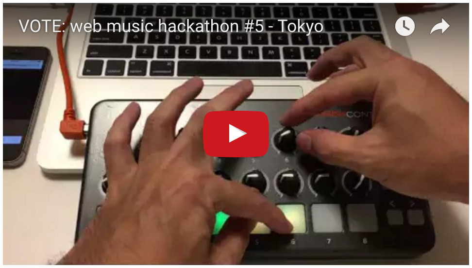
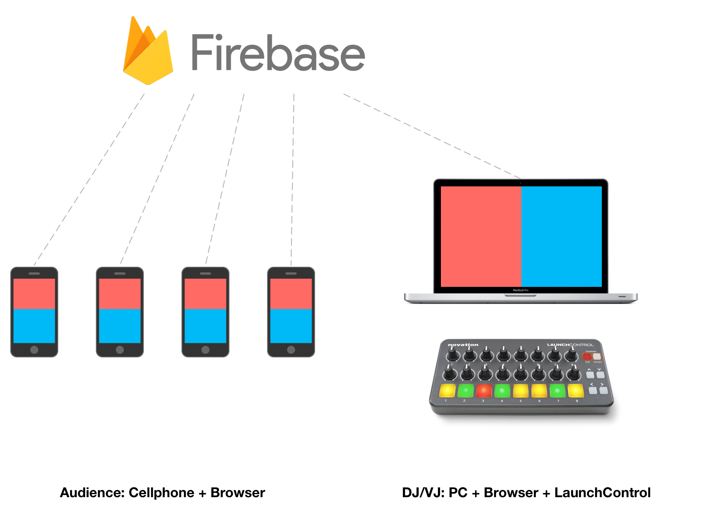
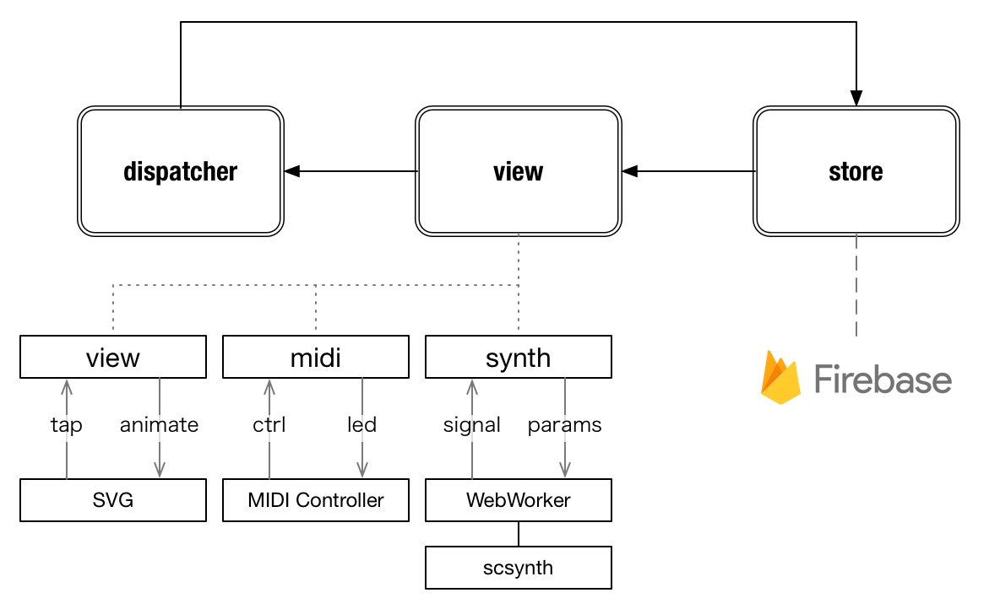

# wmh5-vote

https://wmh5-vote.firebaseapp.com/

## これは何？

- [2016-07-30 Web Music ハッカソン #5](https://plus.google.com/events/c5k6g8vt1b4cmm69r8m3e0qgvao) で作成したDJアプリ
- :tada: 5位 → 繰上げ3位受賞作品です！！

## コンセプト

- 操作のいらないDJアプリ
- 透明なUI
- 疎結合なハック
- メタハック
- 半日程度で作れるもの

## 操作方法

#### 観客

- スマホのブラウザで[アプリのページ](https://wmh5-vote.firebaseapp.com/)を開く
- 雰囲気で画面の上か下(赤か青の領域)をタップする
- 同じようにアプリのページを開いている(DJを含めた)全員の画面が同期して光る

:+1: 画面の構成要素がほとんどないのでスマホの画面を見ずに操作できる。

#### DJ

- PCのブラウザで[アプリのページ](https://wmh5-vote.firebaseapp.com/)を開く
- `Control+Command+F`などでフルスクリーンにする
- 観客が画面をタップしたのに合わせて画面が光る
- それに合わせて雰囲気で演奏内容を変えたり無視したりする

:+1: 画面を開くだけなので操作の必要がなくプレイに集中できる。

#### DJ/sound

- [Novation LaunchControl](http://www.h-resolution.com/novation/launchcontrol.php)を接続（接続すると横レイアウトになる親切設計）
- 8トラックのドローン
- パッドで各トラックをON/Off
- 上ノブで音の雰囲気を調節
- 下ノブで音量を調節

サウンドは[SuperCollider](http://supercollider.github.io/)で作成したものを色々やってJavaScriptで再生している。

音の定義はこういう感じ。

- [misc/drone.scd](misc/drone.scd)

音の定義をシリアライズしたもの(`drone.scsyndef`)を[JSONにコンバート](https://github.com/mohayonao/synthdef-decoder)してfirebaseに保存、それぞれの端末でそれを解釈して音を再生している。

## 構成図

## データフロー

- 単方向データフロー
- `dispatcher` は単なる EventEmitter
- `store` は `dispatcher` からデータを受けて
  -  firebase経由で全体に通知 or そのままemitしてローカルに通知
- `view` は役割ごとに3つに分割

## 使った技術/ライブラリ

- [firebase](https://firebase.google.com/) - データの同期に使用
- [SuperCollider](http://supercollider.github.io/) - 音作りに使用
- [mohayonao/scsynth](https://github.com/mohayonao/scsynth) - SuperColldierの音源部分をJavaScriptにポートしたもの
- [mohayonao/web-midi-emitter](https://github.com/mohayonao/web-midi-emitter) - MIDIコントローラーの操作に使用
- その他定番開発ツール: [browserify](http://browserify.org/) / [babelify](https://github.com/babel/babelify) / [wachify](https://github.com/substack/watchify) / [eslint](http://eslint.org/)

## はまったところ

- :iphone: iOSがWebWorkerをキャッシュして更新されない
  - WebWorkerのパスを `"worker.js?" + Date.now()` として対処
- :fire: firebase に同じ値をセットした時、更新の通知がされない
  - 画面のタップを 0 or 1 で書き込んで通知したかった..
  - `value + Math.random()` として対処
  - そもそもdatabaseでやることでない気がする
- :rage4: しばらくすると音がめっちゃ壊れる
  - `scsynth` に問題あるっぽい
  - やばそうな時に強制リセットして対処

## Fork

- このリポジトリをfork/cloneする
- `npm install`
- firebaseでアプリを作成
- `.firebaserc` を自分のアプリ名に変更
- `src/_config.js` を `src/config.js` にリネームしてAPIキーを設定
- `npm run deploy`

## License

MIT
